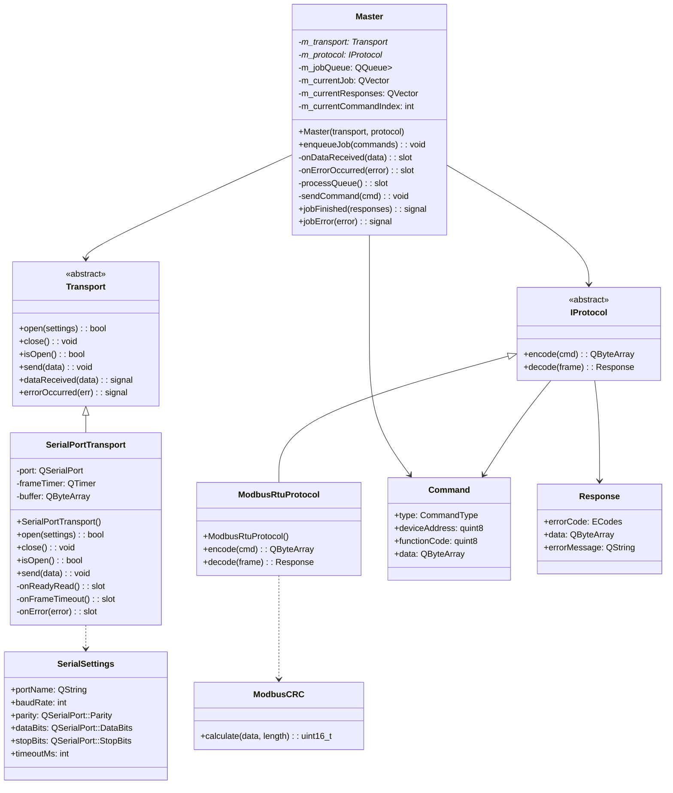
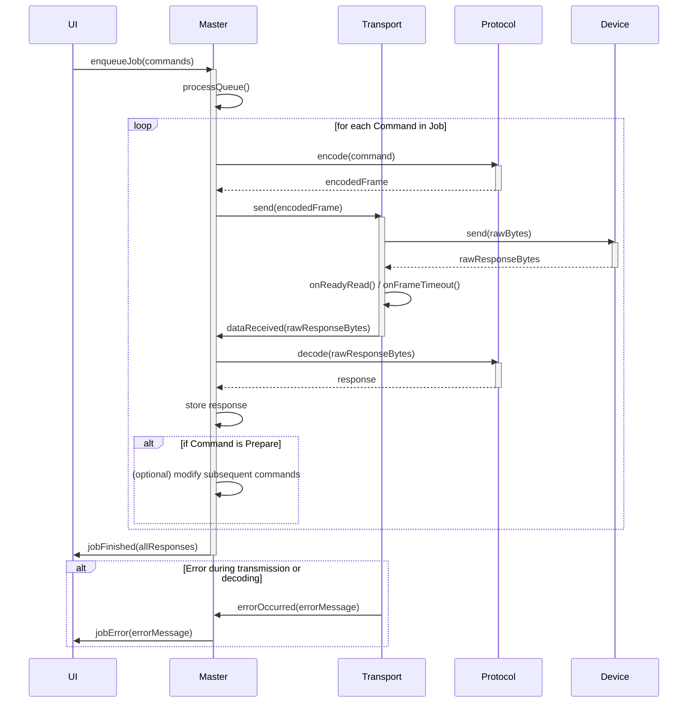

# Документация проекта Modbus RTU Plugin

## 1. Введение
Данный проект представляет собой плагин на C++ для обмена данными по протоколу Modbus RTU, разработанный в среде Qt версии 5.12. Текущий базовый проект требует переработки и доработки для соответствия описанной архитектуре и функциональности.

## 2. Цель проекта
Основная цель проекта — создание гибкой и расширяемой системы для взаимодействия с устройствами по протоколу Modbus RTU, с возможностью обработки сложных сценариев запросов и ответов, а также интеграции с пользовательским интерфейсом (UI).

## 3. Архитектура и компоненты

### 3.1. Базовый класс Transport
*   **Назначение:** Обеспечение базовых методов д��я обмена данными.
*   **Реализация:** Файл `IRxtX` должен быть переопределен как базовый класс `Transport`.
*   **Наследование:** Все остальные классы, отвечающие за общение с устройствами, должны наследоваться от `Transport`.

#### 3.1.1. Принцип работы Transport
`Transport` является абстрактным базовым классом, определяющим унифицированный интерфейс для различных механизмов передачи данных. Он предоставляет виртуальные методы для открытия, закрытия, проверки состояния и отправки данных, а также сигналы `dataReceived` и `errorOccurred` для асинхронного уведомления о событиях. Это позволяет `Master` классу работать с любым типом транспорта, не зная его конкретной реализации.

#### 3.1.2. Принцип работы SerialPortTransport
`SerialPortTransport` — это конкретная реализация `Transport`, использующая `QSerialPort` для взаимод��йствия по последовательному порту.
*   **Открытие/Закрытие:** Метод `open` настраивает и открывает последовательный порт согласно переданным `SerialSettings`. Метод `close` закрывает порт.
*   **Отправка данных:** Метод `send` записывает `QByteArray` в последовательный порт.
*   **Прием данных:** При получении данных от `QSerialPort` (сигнал `readyRead`), данные считываются в буфер (`buffer`). Запускается таймер (`frameTimer`), который сбрасывается при каждом новом поступлении данных. По истечении таймера (что означает конец кадра), накопленные данные в `buffer` эмитируются через сигнал `dataReceived`.
*   **Обработка ошибок:** Ошибки `QSerialPort` перехватываются и эмитируются через сигнал `errorOccurred`.

### 3.2. Интерфейс Protocol
*   **Назначение:** Определение общего интерфейса для протоколов обмена данными.
*   **Реализация:** Должен быть создан интерфейс `IProtocol`.
*   **Наследование:** Должны быть созданы наследники `IProtocol`, в частности, для протокола Modbus RTU.

#### 3.2.1. Принцип работы IProtocol и ModbusRtuProtocol
`IProtocol` — это абстрактный интерфейс, который определяет два ключевых метода: `encode` и `decode`.
*   **`encode(const Command &cmd)`:** Принимает объект `Command` и преобразует его в `QByteArray`, готовый для отправки через `Transport`.
*   **`decode(const QByteArray &frame)`:** Принимает полученный `QByteArray` (кадр данных) и парсит его, возвращая структурированный объект `Response`, содержащий код ошибки, данные и сообщение об ошибке.

`ModbusRtuProtocol` является конкретной реализацией `IProtocol` для протокола Modbus RTU.
*   **Кодирование:** Метод `encode` формирует Modbus RTU кадр, включая адрес устройства, код функции, данные и контрольную сумму CRC16 (используя `ModbusCRC::calculate`).
*   **Декодирование:** Метод `decode` проверяет целостность полученного кадра (например, по CRC16), извлекает адрес устройства, код функции, данные и формирует `Response` объект, указывая соответствующий `ECodes` в случае ошибки (например, `ecBadCS` при неверной контрольной сумме).

### 3.3. Класс Command
*   **Назначение:** Инкапсуляция команды к устройству.
*   **Содержимое:**
    *   Поле `frame` (кадр данных).
    *   Поле `address` (адрес устройства).
    *   Поле `protocol` (ссылка на используемый протокол).
    *   Методы `handleResponse` для обработки ответа.
*   **Формирование кадра:** При создании экземпляра класса `Command` на основе команды, протокола и других данных должен формироваться соответствующий кадр (`frame`).
*   **Типы команд:**
    *   **"Подготовительная" команда:** Используется, когда ответ должен со��ержаться в нескольких кадрах, и необходимо предварительно узнать длину полного ответа (сделать запрос для получения этой информации).
    *   **Основная команда:** Используется для получения основных данных.

#### 3.3.1. Структура Command
Структура `Command` инкапсулирует всю необходимую информацию для выполнения одной операции Modbus.
*   `CommandType type`: Определяет тип команды: `Prepare` (подготовительная, например, для запроса длины данных) или `Main` (основная, для чтения/записи).
*   `quint8 deviceAddress`: Адрес Modbus-устройства, к которому направлена команда.
*   `quint8 functionCode`: Код функции Modbus (например, 0x03 для чтения Holding Registers).
*   `QByteArray data`: Полезные данные команды (например, начальный адрес регистра и количество регистров для чтения).

### 3.4. Класс Master
*   **Назначение:** Содержит и управл��ет очередями запросов.
*   **Структура:** Должен содержать вектор векторов команд, что позволяет объединять запросы в списки для возврата полного ответа на основании подготовительного запроса.
*   **Метод `handleResponse`:**
    *   Обрабатывает кадр ответа в соответствии с протоколом.
    *   Возвращает структуру вида `{int8_t errorCode, string data, string errorMessage}`.

#### 3.4.1. Алгоритм работы Master
Класс `Master` является центральным узлом для управления последовательностью запросов и ответов.
1.  **Инициализация:** `Master` создается с указателями на объекты `Transport` и `IProtocol`, к сигналам которых он подключается.
2.  **Добавление задания:** Метод `enqueueJob(const QVector<Command> &commands)` добавляет вектор команд (представляющий собой одно логическое "задание") в очередь `m_jobQueue`.
3.  **Обработка очереди:** Метод `processQueue()` (вызываемый, например, после завершения предыдущей команды или при добавлении нового задания) извлекает следующее задание из `m_jobQueue` и начинает его выполнение.
4.  **Выполнение команд в задании:**
    *   `Master` отправляет текущую команду (`m_currentJob[m_currentCommandIndex]`) через `m_transport->send()`, предварительно закодировав ее с помощью `m_protocol->encode()`.
    *   Ожидает сигнал `dataReceived` от `Transport`.
    *   При получении данных, `Master` использует `m_protocol->decode()` для парсинга ответа.
    *   Результат (объект `Response`) сохраняется в `m_currentResponses`.
    *   Если текущая команда была "подготовительной" (`Command::Prepare`), `Master` может использовать полученные данные для динамического формирования или модификации последующих команд в текущем задании.
    *   Переходит к следующей команде в `m_currentJob`.
5.  **Завершение задания:** Когда все команды в `m_currentJob` выполнены, `Master` эмитирует сигнал `jobFinished(const QVector<Response> &responses)`, передавая все собранные ответы. Затем он переходит к следующему заданию в `m_jobQueue`.
6.  **Обработка ошибок:** При получении сигнала `errorOccurred` от `Transport` или при обнаружении ошибки в `decode` методе `IProtocol`, `Master` эмитирует сигнал `jobError(const QString &error)`, прерывая текущее задание.

## 4. Настройки и конфигурация
*   **Хранение данных:** Настройки JSON используются для хранения данных всех регистров устройства, включая их значения и адреса.
*   **Обязательные команды:** Должны быть реализованы обязательные команды, которые выполняют запросы от UI на основе этих настроек.

## 5. Логика работы
1.  **Запрос от UI:** Пользовательский интерфейс (UI) инициирует запрос.
2.  **Формирование команд:**
    *   Если длина ответа изначально известна или не требуется, формируется вектор команд для выполнения операции. Этот вектор формируется и управляется в классе `Master`.
    *   Если длина ответа неизвестна, сначала выполняется "подготовительная" команда. На основании полученной информации формируется вектор основных команд.
3.  **Обработка данных:** В классе `Command` парсится полученные данные (`data`) и возвращается результат.
4.  **Эмиссия событий:** Класс `Master` эмитирует соответствующие события или ошибки в UI.

## 6. Интерфейс для UI (виртуальные методы)
Для взаимодействия с UI должны быть реализованы следующие виртуальные методы:

```cpp
virtual void parameterI(int ecode, int index, int value)       = 0;
virtual void parameterF(int ecode, int index, float value)     = 0;
virtual void parameterIset(int ecode, int index, int value)    = 0;
virtual void parameterFset(int ecode, int index, float value)  = 0;
virtual void parametersI(int ecode, QVector<int>   values)     = 0;
virtual void parametersF(int ecode, QVector<float> values)     = 0;
virtual void parametersIset(int ecode, QVector<int>   values)  = 0;
virtual void parametersFset(int ecode, QVector<float> values)  = 0;
```

## 7. Диаграммы

### 7.1. Диаграмма классов (Class Diagram)


### 7.2. Диаграмма последовательности (Sequence Diagram) для выполнения запроса

